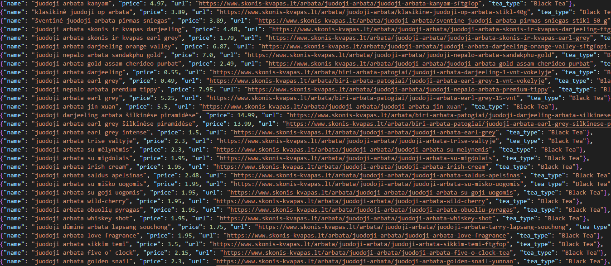

# Website Scraper (Scrapy Framework)

## Overwiew

This web scraper is built using the Scrapy framework. The scraper is designed to extract data from **skonis ir kvapas** website and can be customized for various use cases.

## Requirements

- Python 3.x
- Scrapy framework
- ScrapeOps library

## Installation

**1. Clone the repository:**
```bash
git clone https://github.com/d-alfa/Scraper.git
```
**2. Install the required dependencies:**
```bash
pip install -r requirements.txt
```
**3. Add your ScrapeOps API key to the settings.py file:**

You can signup for an ScrapeOps API key at https://scrapeops.io

Then add your API key to the **settings.py** file. 
```bash
SCRAPEOPS_API_KEY = 'YOUR_API_KEY_HERE'
```
## Usage

1. Navigate to the project directory:
```bash
cd Scraper/
```
2. Run the scraper:
```bash
scrapy crawl Black_Tea_Spider
```
3. Output:

The scraped data will be saved to **Black_Tea_Data.json** file:


